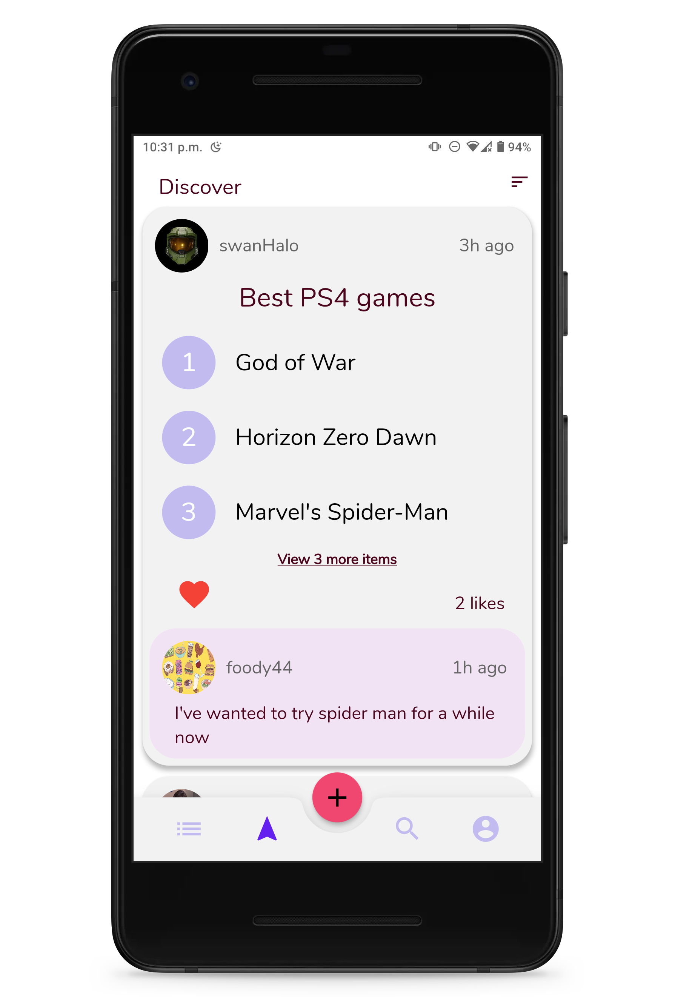
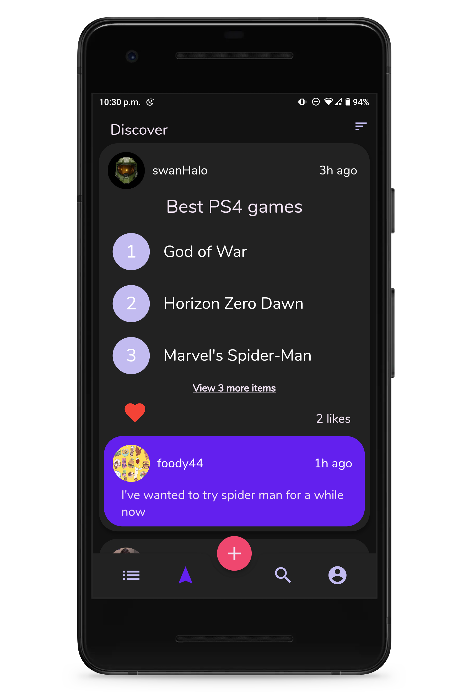
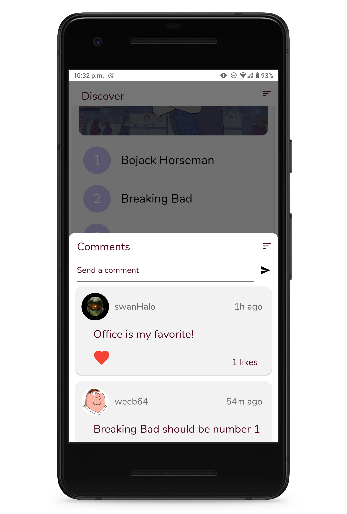
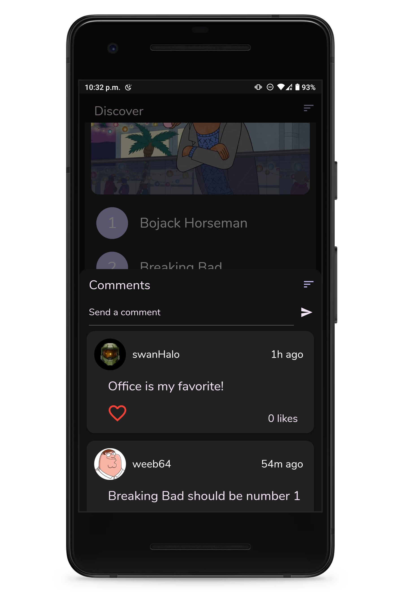
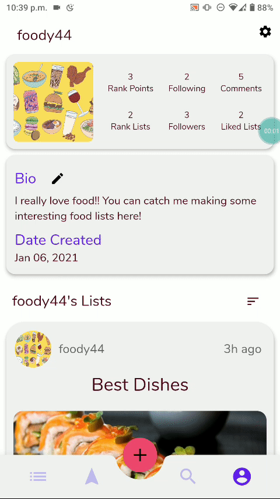

# Rank 10 Mobile App

Rank 10 is a platform that allows users to create and share top ten lists on any topic. This repository is a cross platform mobile client for Rank 10 built using the Flutter framework.

## Features
- Create and customize an account with a profile picture and a bio that can display interests
- Easily create and edit top ten lists that are either private or public
- Drag and drop to quickly reorder rankings within your list
- Follow other users with similar interests to see what lists they create
- Discover new lists
- Search for lists on topics that interest you
- Like lists that catch your interest to have quick access to them through your profile
- Comment on lists
- Dark mode

## Showcase

